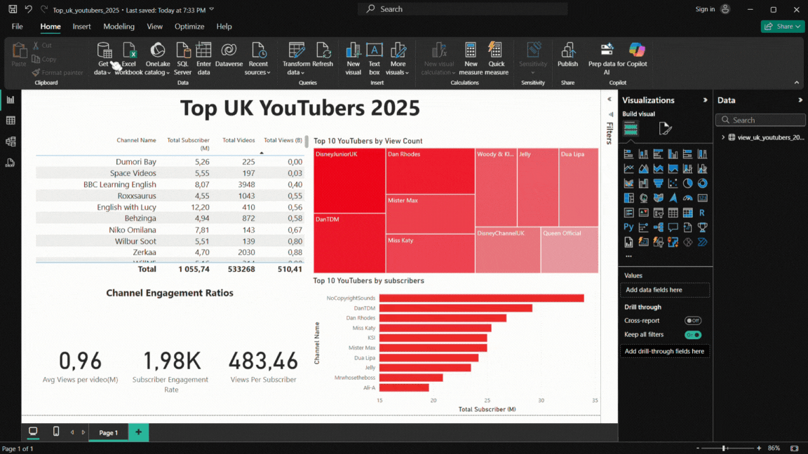

# Data Portfolio: Excel to Power BI
## Top UK YouTubers 2025


# Table of contents 

- [Objective](#objective)
- [Data Source](#data-source)
- [Stages](#stages)
- [Design](#design)
  - [Mockup](#mockup)
  - [Tools](#tools)
- [Development](#development)
  - [Pseudocode](#pseudocode)
  - [Data Exploration](#data-exploration)
  - [Data Cleaning](#data-cleaning)
  - [Transform the Data](#transform-the-data)
  - [Create the SQL View](#create-the-sql-view)
- [Testing](#testing)
  - [Data Quality Tests](#data-quality-tests)
- [Visualization](#visualization)
  - [Results](#results)
  - [DAX Measures](#dax-measures)
- [Analysis](#analysis)
  - [Findings](#findings)
  - [Validation](#validation)
  - [Discovery](#discovery)
- [Recommendations](#recommendations)
  - [Potential ROI](#potential-roi)
  - [Potential Courses of Actions](#potential-courses-of-actions)
- [Conclusion](#conclusion)


# Objective 

- What is the key pain point? 

The Head of Marketing wants to find out who the top YouTubers are in 2025 to decide on which YouTubers would be best to run marketing campaigns throughout the rest of the year.


- What is the ideal solution? 

To create a dashboard that provides insights into the top UK YouTubers in 2025 that includes their: 
- subscriber count
- total views
- total videos, and
- engagement metrics

This will help the marketing team make informed decisions about which YouTubers to collaborate with for their marketing campaigns.

## User story 

As the Head of Marketing, I want to use a dashboard that analyses YouTube channel data in the UK. 

This dashboard should allow me to identify the top-performing channels based on metrics like subscriber base and average views. 

With this information, I can make more informed decisions about which Youtubers are right to collaborate with, and therefore maximise how effective each marketing campaign is.


# Data source 

- What data is needed to achieve our objective?

We need data on the top UK YouTubers in 2025 that includes their:
- channel names
- total subscribers
- total views
- total videos uploaded


- Where is the data coming from? 
The data is sourced from Kaggle (an Excel extract), [see here to find it.](https://www.kaggle.com/datasets/bhavyadhingra00020/top-100-social-media-influencers-2024-countrywise?resource=download)


# Stages

- Design
- Development
- Testing
- Analysis
 


# Design 

## Dashboard components required 
- What should the dashboard contain based on the requirements provided?

To understand what it should contain, we need to figure out what questions we need the dashboard to answer:

1. Who are the top 10 YouTubers with the most subscribers?
2. Which 3 channels have uploaded the most videos?
3. Which 3 channels have the most views?
4. Which 3 channels have the highest average views per video?
5. Which 3 channels have the highest views per subscriber ratio?
6. Which 3 channels have the highest subscriber engagement rate per video uploaded?

For now, these are some of the questions we need to answer, this may change as we progress down our analysis. 


## Dashboard mockup

- What should it look like? 

Some of the data visuals that may be appropriate in answering our questions include:

1. Table
2. Treemap
3. Scorecards
4. Horizontal bar chart 


## Tools 


| Tool       | Purpose                                               |
| ---        | ---                                                   |  
| Excel      | Exploring the data                                    |
| SQL Server | Cleaning, testing, and analysing the data             |
| Power BI   | Visualising the data via interactive dashboards       |
| GitHub     | Hosting the project documentation and version control |
| Mokkup AI  | Designing the mockup of the dashboard                 | 


# Development

## Pseudocode

- What's the general approach in creating this solution from start to finish?

1. Get the data
2. Explore the data in Excel
3. Load the data into SQL Server
4. Clean the data with SQL
5. Test the data with SQL
6. Visualise the data in Power BI
7. Generate the findings based on the insights
8. Write the documentation + commentary
9. Publish the data to GitHub Pages

## Data exploration notes

This is the stage where you have a scan of what's in the data, errors, inconsistencies, bugs, weird and corrupted characters, etc  


- What are your initial observations with this dataset? What's caught your attention so far? 

1. There are at least 4 columns that contain the data we need for this analysis, which signals we have everything we need from the file without needing to contact the client for any more data. 
2. The first column contains the channel ID with what appears to be channel IDS, which are separated by a @ symbol - we need to extract the channel names from this.
3. Some of the cells and header names are in a different language - we need to confirm if these columns are needed, and if so, we need to address them.
4. We have more data than we need, so some of these columns would need to be removed


## Data cleaning 
- What do we expect the clean data to look like? (What should it contain? What constraints should we apply to it?)

The aim is to refine our dataset to ensure it is structured and ready for analysis. 

The cleaned data should meet the following criteria and constraints:

- Only relevant columns should be retained.
- All data types should be appropriate for the contents of each column.
- No column should contain null values, indicating complete data for all records.

Below is a table outlining the constraints on our cleaned dataset:

| Property          | Description |
| ---               | ---         |
| Number of Rows    | 100         |
| Number of Columns | 4           |

And here is a tabular representation of the expected schema for the clean data:

| Column Name       | Data Type | Nullable |
| ---               | ---       | ---      |
| channel_name      | VARCHAR   | NO       |
| total_subscribers | INTEGER   | NO       |
| total_views       | INTEGER   | NO       |
| total_videos      | INTEGER   | NO       |


- What steps are needed to clean and shape the data into the desired format?

1. Remove unnecessary columns by only selecting the ones you need.
2. Extract YouTube channel names from the first column.
3. Rename columns using aliases.


### Transform the data 


```sql
/*
# 1. Select the required columns
# 2. Extract the channel name from the 'NOMBRE' column
*/

-- 1.
SELECT
    SUBSTRING(NOMBRE, 1, CHARINDEX('@', NOMBRE) -1) AS channel_name,  -- 2.
    total_subscribers,
    total_views,
    total_videos

FROM
    top_uk_youtubers_2025
```


### Create the SQL view 

```sql
/*
# 1. Create a view to store the transformed data
# 2. Cast the extracted channel name as VARCHAR(100)
# 3. Select the required columns from the top_uk_youtubers_2024 SQL table 
*/

-- 1.
CREATE VIEW view_uk_youtubers_2025 AS

-- 2.
SELECT CAST(SUBSTRING(NOMBRE,1,CHARINDEX('@', NOMBRE)-2) AS varchar(100)) AS channel_name, --CONVERTED TO STRING RESTRICTING WITH 100 CHARACTERS
	total_subscribers,
	total_views,
	total_videos

-- 3.
FROM top_uk_youtubers_2025

```


# Testing 

- What data quality and validation checks are you going to create?

Here are the data quality tests conducted:

## Row count check

```sql
/*
    Count the total number of rows (or records) in the SQL view. 
		Expected row count: 100
*/

SELECT 
	COUNT(*) AS no_of_rows
FROM 
	view_uk_youtubers_2025;

```


## Column count check
### SQL query 
```sql
/*
		Count the total number of columns (or fields) in the SQL view. 
		Expected column count: 4
*/

SELECT 
	COUNT(*) AS column_count
FROM 
	INFORMATION_SCHEMA.COLUMNS --want information about the columns
WHERE 
	TABLE_NAME='view_uk_youtubers_2025';
```
### Output 


## Data type check
### SQL query 
```sql
/*
		Check the data types of each column from the SQL view by checking the INFORMATION SCHEMA view. 
		Expected Data types:
			channel_name= VARCHAR
			total_subscribers= INT OR BIGINT
			total_views= INT OR BIGINT
			total_videos= INT OR BIGINT
*/

SELECT 
	COLUMN_NAME,
	DATA_TYPE
FROM 
	INFORMATION_SCHEMA.COLUMNS 
WHERE 
	TABLE_NAME='view_uk_youtubers_2025';
```
### Output


## Duplicate count check
### SQL query 
```sql
/*
		-- (1) Check for duplicate rows in the view.
		-- (2) Group by the channel names.
		-- (3) Filter for groups with more than one row.
		Expected result: ZERO Duplicates
*/

--1.
SELECT
	channel_name,
	COUNT(*) AS duplicate_count
FROM
	view_uk_youtubers_2025

--2.
GROUP BY
	channel_name

--3.
HAVING 
	COUNT(*) > 1; --NO results returned = NO duplicates
```
### Output


# Visualization 


## Results

- What does the dashboard look like?



This shows the Top UK YouTubers in 2025 so far. 

## DAX Measures

### 1. Total Subscribers (M)
```sql
Total Subscriber (M) = 
VAR million = 1000000
VAR sumOfSubscribers = SUM(view_uk_youtubers_2025[total_subscribers])
VAR totalSubscribers = DIVIDE(sumOfSubscribers,million)

RETURN totalSubscribers

```

### 2. Total Views (B)
```sql
Total Views (B) = 
VAR billion = 1000000000
VAR sumOfTotalViews = SUM(view_uk_youtubers_2025[total_views])
VAR totalViews = DIVIDE(sumOfTotalViews, billion)

RETURN totalViews

```

### 3. Total Videos
```sql
Total Videos = 
VAR totalVideos = SUM(view_uk_youtubers_2025[total_videos])

RETURN totalVideos

```

### 4. Average Views Per Video (M)
```sql
Avg Views per video(M) = 
VAR sumOfTotalViews = SUM(view_uk_youtubers_2025[total_views])
VAR sumOfTotalVideos = SUM(view_uk_youtubers_2025[total_videos])
VAR avgOfViewsPerVideo = DIVIDE(sumOfTotalViews,sumOfTotalVideos,BLANK())
VAR finalAvgViewsPerVideo = DIVIDE(avgOfViewsPerVideo, 1000000, BLANK())

RETURN finalAvgViewsPerVideo

```


### 5. Subscriber Engagement Rate
```sql
Subscriber Engagement Rate = 
VAR sumOfTotalSubscribers = SUM(view_uk_youtubers_2025[total_subscribers])
VAR sumOfTotalVideos = SUM(view_uk_youtubers_2025[total_videos])
VAR subscriberEngRate = DIVIDE(sumOfTotalSubscribers,sumOfTotalVideos)

RETURN subscriberEngRate

```


### 6. Views per subscriber
```sql
Views Per Subscriber = 
VAR sumOfTotalViews = SUM(view_uk_youtubers_2025[total_views])
VAR sumOfTotalSubscribers = SUM(view_uk_youtubers_2025[total_subscribers])
VAR viewsPerSubscriber = DIVIDE(sumOfTotalViews,sumOfTotalSubscribers, BLANK())

RETURN viewsPerSubscriber

```


# Analysis 

## Findings

- What did we find?

For this analysis, we're going to focus on the questions below to get the information we need for our marketing client - 

Here are the key questions we need to answer for our marketing client: 
1. Who are the top 10 YouTubers with the most subscribers?
2. Which 3 channels have uploaded the most videos?
3. Which 3 channels have the most views?
4. Which 3 channels have the highest average views per video?
5. Which 3 channels have the highest views per subscriber ratio?
6. Which 3 channels have the highest subscriber engagement rate per video uploaded?


### 1. Who are the top 10 YouTubers with the most subscribers?

| Rank | Channel Name         | Subscribers (M) |
|------|----------------------|-----------------|
| 1    | NoCopyrightSounds    | 34.00           |
| 2    | DanTDM               | 29.20           |
| 3    | Dan Rhodes           | 26.80           |
| 4    | Miss Katy            | 25.40           |
| 5    | KSI                  | 25.00           |
| 6    | Mister Max           | 25.00           |
| 7    | Dua Lipa             | 24.20           |
| 8    | Jelly                | 23.50           |
| 9    | Mrwhosetheboss       | 20.90           |
| 10   | Ali-A                | 19.60           |


### 2. Which 3 channels have uploaded the most videos?

| Rank | Channel Name    | Videos Uploaded |
|------|-----------------|-----------------|
| 1    | GRM Daily       | 15,343          |
| 2    | Manchester City | 9,438           |
| 3    | Yogscast        | 7,128           |


### 3. Which 3 channels have the most views?


| Rank | Channel Name | Total Views (B) |
|------|--------------|-----------------|
| 1    | DanTDM       | 20.17           |
| 2    | Dan Rhodes   | 19.19           |
| 3    | Mister Max   | 16.49           |


### 4. Which 3 channels have the highest average views per video?

| Channel Name | Average Views per Video (M) |
|--------------|-----------------            |
| Mark Ronson  | 350.37                      |
| Dua Lipa     | 46.60                       |
| Jessie J     | 41.03                       |


### 5. Which 3 channels have the highest views per subscriber ratio?

| Rank | Channel Name       | Views per Subscriber        |
|------|-----------------   |---------------------------- |
| 1    | GRM Daily          | 1185.79                     |
| 2    | Nickelodeon        | 1061.04                     |
| 3    | Disney Junior UK   | 1031.97                     |


### 6. Which 3 channels have the highest subscriber engagement rate per video uploaded?

| Rank | Channel Name    | Subscriber Engagement Rate  |
|------|-----------------|---------------------------- |
| 1    | Mark Ronson     | 343,000                     |
| 2    | Jessie J        | 110,416.67                  |
| 3    | Dua Lipa        | 104,954.95                  |


